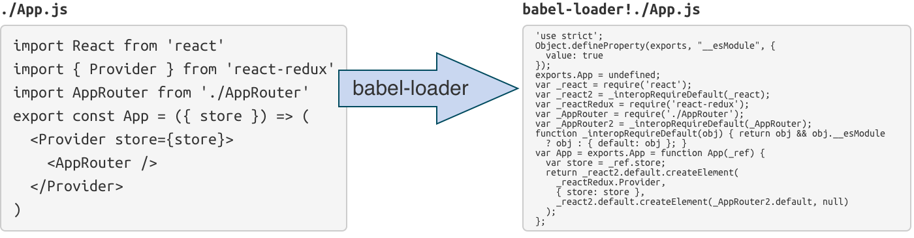
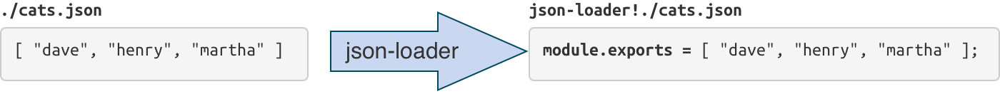
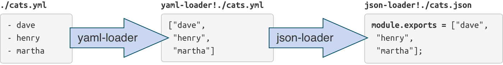

# Introduction to  Webpack {#Cover}

*By Julien Tanguy*

<!-- logo from http://webpack.github.io/docs -->

## Another task runner ?

- Make
- Grunt
- Gulp
- Mimosa

## **No**

<!-- picture from http://knowyourmeme.com/ -->

## Another package manager ?

- npm
- bower

## **No**

<!-- picture from http://knowyourmeme.com/ -->

## **browserify on steroids**

## 
{:.cover .h .white}

## 
{:.cover .w .white}

## Packaging

1. Entry point(s)
2. Load dependencies transitively via loaders
3. Apply plugins to the whole dependency tree

## **loaders**

## **Converts files into commonJS modules**

## 
{:.cover .w .white}

## 
{:.cover .w .white}

## Other languages
{:.small}

~~~javascript
import stylesheet from 'styles/my-styles.scss';
import logo from 'img/my-logo.svg';
import someTemplate from 'html/some-template.html';
console.log(stylesheet);
//"body{font-size:12px}"
console.log(logo);
//"data:image/svg+xml;base64,PD94bWwgdmVyc2lvbj0iMS4wIiBlbmNvZGluZz0iVVRGLTgiIHN0YW5kYWxvbmU9Im5[...]"
console.log(someTemplate);
//"<html><body><h1>Hello</h1></body></html>"
~~~

## **chainable**

## 
{:.cover .w .white}

## Lots of loaders

- basic: `json, raw, xml, dsv, yaml...`
- packaging: `file, url, image, uglify, vue, s3...`
- dialects: `coffee, babel, ts, purs, elm, ion...`
- templating: `html, pug, jsx, mustache, swig...`
- styling: `css, less, sass, stylus, postcss...`
- translation: `po, format, properties, gettext...`
- support: `mocha, istambul, eslint, standard...`

## **plugins**

## Uses

- Extract some common dependencies into another chunk
- Expose some build-time constants

`environment, commonsChunk, define, s3...`

## **HMR & dev-server**

## code splitting

~~~javascript
//static imports
import _ from 'lodash'

// dynamic imports
require.ensure([], function(require) {
  const d3 = require('d3')
  //do d3 stuff
  })
~~~

## 
{:.cover .h .white}

